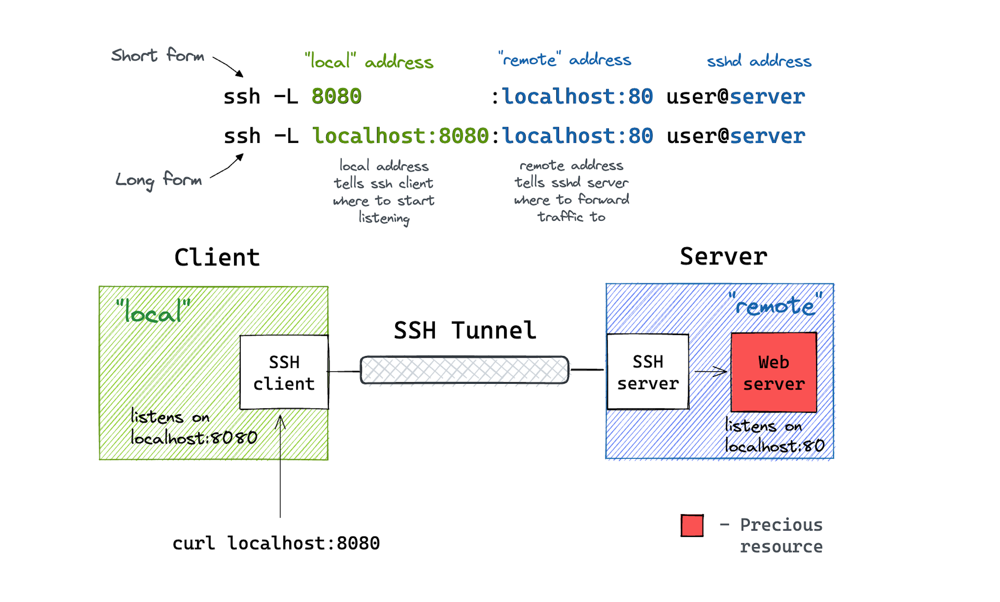
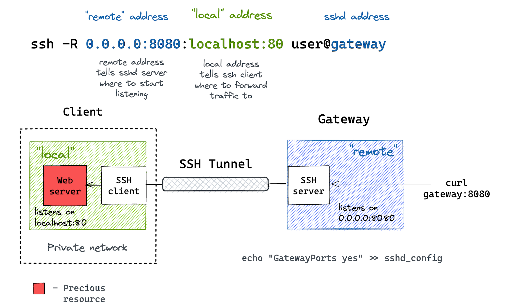
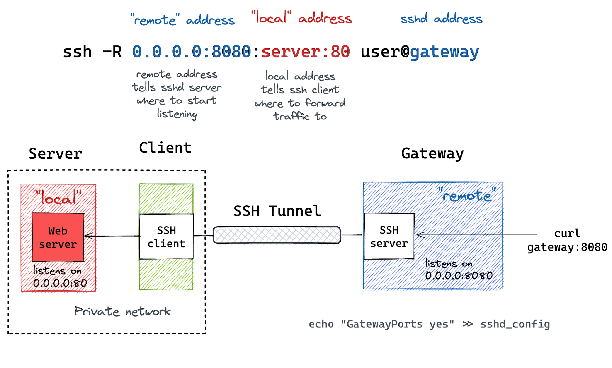
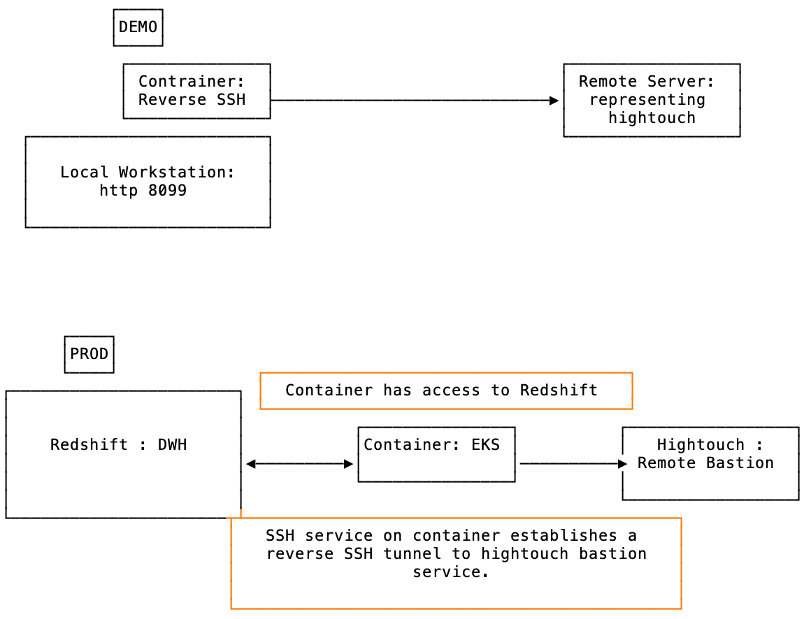

# Dockerize SSHD daemon for ssh tunnel

## Backgroud

### What is SSH Tunneling / Port Forwarding

- aka, port forwarding
- A method for creating an encrypted SSH connection b/w a client and server machine, through which service ports can be relayed
- The encrypted SSH tunnel is used to allow other network traffic to pass inside of the tunnel
- SSH forwarding is useful for transporting network data that typically used an unencrypted protocol, accessing geo-restricted content, or bypassing intermediate firewalls

#### Three Types of SSH port forwarding

- local port forwarding : forwards a connection from the client host to the SSH server and then to its destination port
  - can be used to allow local client to connect to remote service over a secure tunnel
  - ex. using a SQL client to connect to a DB Server that is only accessible via SSH
- remote port forwarding : forwards a port from the server to the client host and then to the destination port
  - can be used to share a local service to a remote host over a secure tunnel
  - ex. sharing a locally running website to a remote user over ssh
- dynamic port forwarding : creates a SOCKS proxy that allows communication across a range of ports

#### Local Port Forwarding

- allows you to create a local port that is forwarded to a remote port ... what does this mean ...

### Sidebar: what is a port

- a port is an addressable network location implemented in an operating system to differentiate traffic destined for different services or applications
- a port is always associated with an IP address of a host and the protocol type for communication
- listening : a service is "listening" when it it bound to a port/protocol/IP address and waiting for clients to request the service

NOTE: `lsof -i # list all open ports`

For SSH tunnelling, it is releveant to know that the *ssh* service listens on port 22 by default.

```shell
➜  notebooks git:(main) ✗ lsof -i | grep ssh
ssh       99649 mladd    4u  IPv4 0x4903d034de57b337      0t0  TCP 10.0.0.14:59303->10.0.0.22:ssh (ESTABLISHED)
ssh       99649 mladd    5u  IPv4 0x4903d034de57b337      0t0  TCP 10.0.0.14:59303->10.0.0.22:ssh (ESTABLISHED)
```

### Port Categories

- 0-1023 : well known port, associated with services that are considered to be critical/essential (aka, System Ports)
- 1024-49151 : registered ports / user ports, their usage can be reserved by a request to IANA (Internet Assignned Numbers Authority)
- 49152-65535 : dynamic ports, suggested for private usage

NOTE : `cat /etc/services` -> list of well known and registered ports

### Port Examples

- Let's say we have a webserver hosting a page that is only available via the loopback adapter
- A loopback adapter is a virtual network interface that a system uses to communicate with itself
- This means you have to be on this remote server in order to access the webpage
- If we are able to ssh into the remote server, we can create a local port that gets forwarded to the remote webserver

```shell
# loopback
➜  notebooks git:(main) ✗ ifconfig | grep lo0
lo0: flags=8049<UP,LOOPBACK,RUNNING,MULTICAST> mtu 16384

# first network adapter
➜  notebooks git:(main) ✗ ifconfig | grep en0
en0: flags=8863<UP,BROADCAST,SMART,RUNNING,SIMPLEX,MULTICAST> mtu 1500
        inet6 fe80::18fc:11ac:a9fe:dc56%en0 prefixlen 64 secured scopeid 0xf


➜  notebooks git:(main) ✗ ifconfig
lo0: flags=8049<UP,LOOPBACK,RUNNING,MULTICAST> mtu 16384
        options=1203<RXCSUM,TXCSUM,TXSTATUS,SW_TIMESTAMP>
        inet 127.0.0.1 netmask 0xff000000
        inet6 ::1 prefixlen 128
        inet6 fe80::1%lo0 prefixlen 64 scopeid 0x1
        inet 127.0.0.5 netmask 0xff000000
        nd6 options=201<PERFORMNUD,DAD>
```

```shell
# on remote host, zorn
➜  ~ python3 -m http.server 8080
Serving HTTP on 0.0.0.0 port 8080 (http://0.0.0.0:8080/) ...
10.0.0.14 - - [18/Jan/2024 22:23:21] "GET / HTTP/1.1" 200 -
10.0.0.14 - - [18/Jan/2024 22:23:21] code 404, message File not found
10.0.0.14 - - [18/Jan/2024 22:23:21] "GET /favicon.ico HTTP/1.1" 404 -

# test on local host w/ browser
http://10.0.0.22:8080

# test via CLI
➜  notebooks git:(main) ✗ nc -zv 10.0.0.22 8080
Connection to 10.0.0.22 port 8080 [tcp/http-alt] succeeded!

# on remote host, zorn
➜  ~ python3 -m http.server -b 127.0.0.1 8080
Serving HTTP on 127.0.0.1 port 8080 (http://127.0.0.1:8080/) ...

# test with browser locally
Unable to connnect

# test via CLI
➜  notebooks git:(main) ✗ nc -zv 10.0.0.22 8080
nc: connectx to 10.0.0.22 port 8080 (tcp) failed: Connection refused

# test via CLI on remote host
➜  ~ hostname
zorn
➜  ~ nc -zv 127.0.0.1 8080
Connection to 127.0.0.1 8080 port [tcp/http-alt] succeeded!

```

### Local Port Forwarding Again

- allows you to create a local port that is forwarded to a remote port

```shell
ssh -N -f -L 28080:127.0.0.1:8080 mladd@10.0.0.22

# -N : do NOT execute a remote command, without this flag you would get a shell on the remote server
# -f : send SSH to the background (daemonize)
# -L : tell SSN to forward a local port
# 288080:127.0.0.1:8080 : bind local port `208080` on localhost (127.0.0.1) to the remote port `8080`
# mladd@10.0.0.22 : tell SSH to log in to the remote server as the specified user to establish a SSH tunnel
#                 : port 208080 on the loopback interface is bound to port 80 on the remote host
#                 : any traffic on 127.0.0.1:208080 is now forwarded to the remote host on port 80

# test via browser
http://localhost:28080

# test connectivity from local workstation
➜  notebooks git:(main) ✗ nc -vz 127.0.0.1 28080
Connection to 127.0.0.1 port 28080 [tcp/*] succeeded!

# kill ssh tunnel
ps aux | grep ssh
kill PID

```



### Remote Port Forwarding

- remote port forwarding is the opposite of local port forwarding
- remote port forwarding is used to expose a local service to the outside world
- let's again say we have a webserver that is only listening on a loopback adapter
- let's also assume that our local workstation cannot directly reach the remote host where the webserver is running
- there is an intermediate host that is reachable by both our local workstation and the remote host

```shell
ssh -N -f -R 3000:127.0.0.1:8080 mladd@gateway.pub
# -N : do NOT execute a remote command, without this flag you would get a shell on the remote server
# -f : send SSH to the background (daemonize)
# -R : tell SSN to bind the remote port 3000 to the local port 8080
# start
```

### More on Remote Port Forwarding

- -R : specifies that connectionns to the given TCP port on the remote side are forwared to the local side



### Remote Port Forwarding with Bastion

```shell
ssh -f -N -R remote_address:remote_port:local_address:local_port username@gateway.pub
# remote_address:remote_port - tells the ssh server where to listen
# local_address:local_port - tells the ssh client where to forward traffic to
# -N : do NOT execute a remote command, without this flag you would get a shell on the remote server
# -f : send SSH to the background (daemonize)
# -R : specify the port on the remote host to be forwarded to the local side
```



### Reverse SSH tunnel Example

- forward a port by connecting as a cliet to a SSH server managed by Hightouch.
- rather than the traditional connection from a local machine to a remote server, reverse SSH tunneling establishes a connection from the remote server to the local machine
- used to gain access to a local machine that is behind a firewall or NAT
- reverse tunneling sets up an omnidirectional connection between a port on a local machine and a port on a remote machine
  - the established connection is used to setup a _new* connection from the local machine back to the remote instance
  - the end state is that you can connect the local machine to the remote instance, so the tunnel (in reverse) allows the remote instance to connect to the local machine

```shell
# on local workstation, setup service that only listens on local interface
python3 -m http.server 8080

# on remote server
➜  ~ hostname
zorn
➜  ~ nc -zv 10.0.0.38 8080
Connection to 10.0.0.38 8080 port [tcp/http-alt] succeeded!

# on local workstation
# setup local only service
python3 -m http.server -b 127.0.0.1 8080

# on remote server
➜  ~ hostname
zorn
➜  ~ nc -zv 10.0.0.38  8080
nc: connect to 10.0.0.38 port 8080 (tcp) failed: Connection refused

# on local workstation
ssh -N -f -R 8080:127.0.0.1:8080 mladd@10.0.0.22

# ps aux | grep ssh
mladd   1884   0.0  0.0 408254784   1888   ??  Ss    2:50PM   0:00.04 ssh -N -f -R 8080:127.0.0.1:8080 mladd@10.0.0.22

# kill ssh
ps aux | grep ssh
kill PID

```

### Reverse SSH Tunneling Hightouch

- requires a server within the VPC to act as a SSH client
- this client server must be able to connect to the public internet and the DWH (redshift)
- when setting up the reverse tunnel in Hightouch, you will receive a private key to download
- ensure key permissions are 0400
- ensure this host key is included to the ~/.ssh/know_hosts file
  - `ssh-rsa AAAAB3NzaC1yc2EAAAADAQABAAABgQCXjpH+c24rYGDBoUdHGN3Yazp4SrDU8Z0Oqb0WRaKJz0VpSPS+Kqmc0MioY3yK1aPDh32VSEFUykEHIobV7dsH9uKlR3OllTkxN9pIk3xfJBn1/x4TS2VX1I+XM7KE6xJH/QmBVaVyNzsYzZ+lR/hUdrVC3czV+ReJa5j+YS23atS3x9NznxHSBBOLcq0RpFj65/WZt0kJwbIqhrGYIq5qXR/8d7gzyCj6vg2iNNUszTFQvcFeQ8zeXC63ke4C9oCFHbneX2odvsDY5DQM6WF7H6j91qRhGEq+niQg2zCns1kJq1Gfa7bY3OxIHmQ3HP0R8ExJMsBBqdKoL5uNY8UK717yNuFzBQUV8fgJi1HZC6JR6uDVpLadbXUV3WD0LA0YQ1h24KKGtPRDrnyZxNTdn0R19asz31npyFHKrP95OIz2RoGuqsn9fr3FzO1wfXjdzYp5l6AAy04K6yPNQfTC/+LLk8U1PWbSsMBqlQnHkp/eMaSdTEVMVxqhAFKCz8M=`

```shell
SERVICE_HOST=redshift.ncsaprod.ue1.ptc.dev
SERVICE_PORT=5439

ssh -i /root/.ssh/key.pem \
    -R 0.0.0.0:56000:$SERVICE_HOST:$SERVICE_PORT \
    tunnel.hightouch.io -p 49100 \
    -o ExitOnForwardFailure=yes```

# -i : path to ssh key file that is downloaded from hightouch when setting up tunnel (https://app.hightouch.com/settings/tunnels)
# -R :
# NOTE: the address of 0.0.0.0 indicates that the listening port of 56000 should bind to ALL IPv4 addresses on the machine
# tunnel.hightouch.io : end point that we are ssh-ing into
# -p 49100 : connect to port 49100 on the remote host (overrideing the default of port 22 for ssh)
# -o ExitOnForwardFailure=yes : ssh will terminate the connection if it cannot setup port forwarding
```



## Docker Stuff

```shell
# generate SSH key
ssh-keygen -t ed25519 -c docker-test-key`

# build docker image
docker build --progress=plain --no-cache -t sshd_tunnel .

# run container locally
docker run -it sshd_tunnel /bin/bash

# run container in daemon mode
docker run -d -p 7822:7822 --name hightouch_ssh sshd_tunnel

# connect to docker container via ssh
ssh -o StrictHostKeyChecking=no  -i ./hightouch_ed25519 root@localhost -p 782

# cleanup docker junk

docker stop hightouch_ssh
docker rm hightouch_ssh
docker rmi sshd_tunnel
```

## autossh

<https://github.com/Autossh/autossh>

## References

- [ ] <https://betterprogramming.pub/running-a-container-with-a-non-root-user-e35830d1f42a>
- [ ] <https://gdevillele.github.io/engine/admin/using_supervisord/>
- [ ] <https://docs.docker.com/config/containers/multi-service_container/>
- [ ] <https://linuxize.com/post/how-to-setup-ssh-tunneling/>
- [ ] <https://qbee.io/misc/reverse-ssh-tunneling-the-ultimate-guide/>
- [ ] <https://grahamhelton.com/blog/ssh-cheatsheet/>
- [ ] <https://iximiuz.com/en/posts/ssh-tunnels/>
- [ ] <https://hightouch.com/docs/security/ssh-tunneling#reverse-tunneling>
- [ ] <https://blog.ippon.tech/ssh-reverse-tunnel-to-private-database>
- [ ] <https://github.com/hightouchio/passage>
- [ ] <https://hub.docker.com/r/georgeyord/reverse-ssh-tunnel>
- [ ] <https://github.com/efrecon/rsshd>
- [ ] <https://github.com/alansdockerfiles/docker-reverse-ssh-tunnel>
- [ ] <https://github.com/nicholasjackson/gophercon2017/tree/master/dockerfiles/reverse_ssh>
